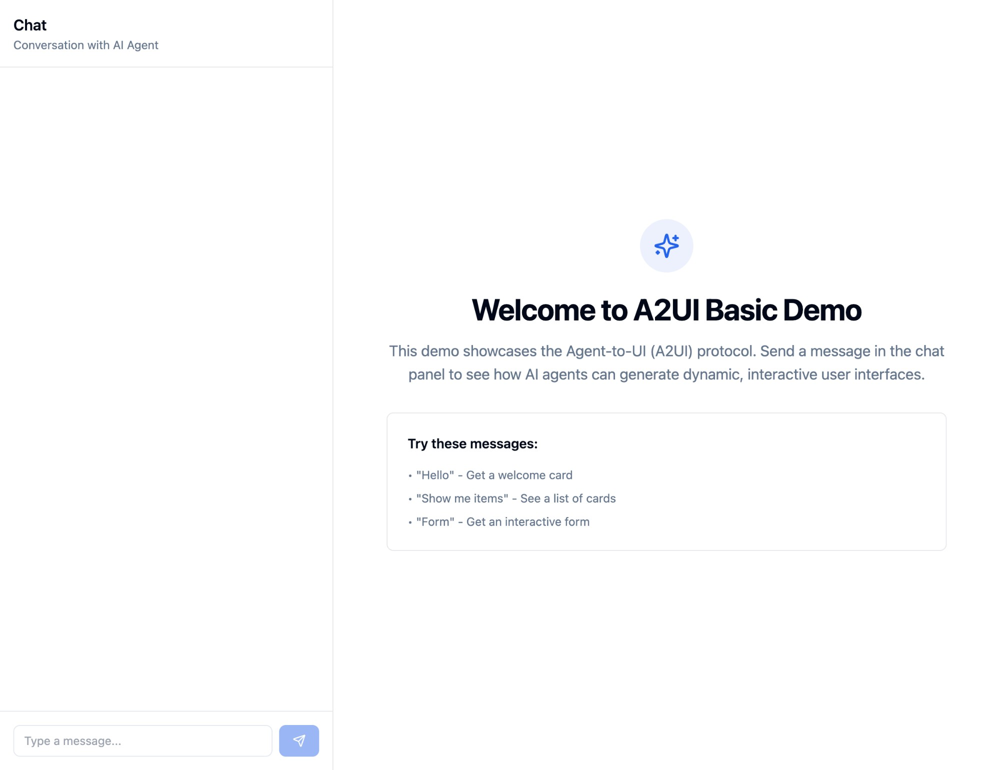
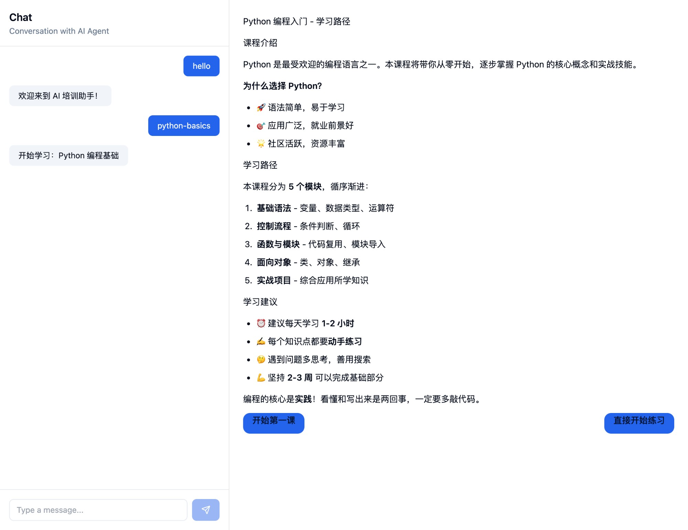
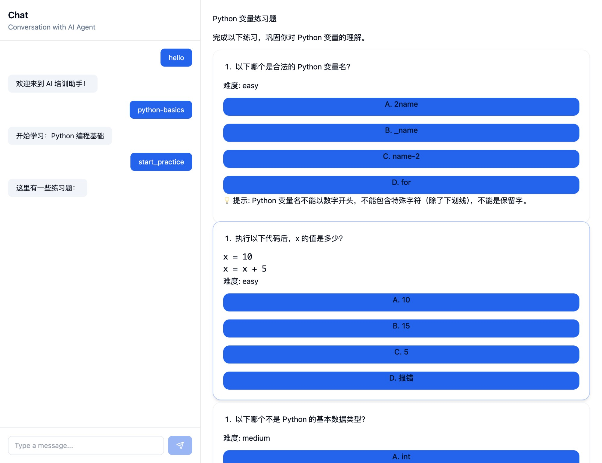

# @zhama/a2ui

<div align="center">

**A2UI Protocol - React Implementation for AI-Driven Dynamic User Interfaces**

**A2UI 协议 - 用于 AI 驱动动态用户界面的 React 实现**

[](https://www.npmjs.com/package/@zhama/a2ui)
[](./LICENSE)
[](https://www.typescriptlang.org/)
[](https://reactjs.org/)

[English](#english) | [中文](#中文)

</div>

---

## English

### 📖 Overview

A2UI (Agent-to-User Interface) is a protocol that enables AI agents to dynamically generate and control user interfaces. This library provides a complete React implementation based on Google's A2UI protocol specification, allowing AI agents to create rich, interactive UIs through structured data instead of plain text responses.

### 🎬 Live Demo

See A2UI in action! The demo showcases an AI training assistant that generates dynamic, interactive UIs based on user conversations.

**Try it yourself:**
```bash
cd examples/basic-demo
npm install
npm run dev
```

Then open http://localhost:5174 and try these commands:
- Type `hello` - Get a welcome screen with topic cards
- Click a topic button - See a structured learning path  
- Type `practice` - Get interactive quiz questions
- Type `progress` - View learning statistics

**What you'll see:**

<table>
  <tr>
    <td width="33%" align="center">
      
      <br/>
      <strong>Welcome Screen</strong>
      <br/>
      <em>AI generates topic cards with actions</em>
    </td>
    <td width="33%" align="center">
      
      <br/>
      <strong>Learning Path</strong>
      <br/>
      <em>Structured content with sections</em>
    </td>
    <td width="33%" align="center">
      
      <br/>
      <strong>Practice Quiz</strong>
      <br/>
      <em>Interactive questions with buttons</em>
    </td>
  </tr>
</table>

> 💡 **Note:** All UIs above are generated dynamically by the AI agent using A2UI protocol - no hardcoded components!

### ✨ Features

- 🤖 **AI-First Design** - Built specifically for AI-driven UI generation
- 📦 **Complete Protocol Support** - Full implementation of A2UI protocol specifications
- 🎨 **Themeable** - Customizable theme system based on Tailwind CSS
- 🧩 **Rich Components** - Comprehensive set of UI components (Text, Button, Card, List, TextField, etc.)
- 🔌 **Extensible** - Support for custom component registration
- 📱 **Responsive** - Mobile-first responsive design
- ⚡ **Performance** - Optimized rendering with React best practices
- 🎯 **Type-Safe** - Full TypeScript support with comprehensive type definitions
- 🌐 **Framework Agnostic** - Core protocol can be adapted to other frameworks
- 🎭 **Event Handling** - Built-in action handling system for interactive components

### 🚀 Quick Start

#### Installation

```bash
npm install @zhama/a2ui
# or
yarn add @zhama/a2ui
# or
pnpm add @zhama/a2ui
```

#### Peer Dependencies

```bash
npm install react react-dom react-markdown
```

#### Basic Setup

1. **Configure Tailwind CSS**

```js
// tailwind.config.js
import a2uiPreset from '@zhama/a2ui/tailwind.preset';

export default {
  presets: [a2uiPreset],
  content: [
    './src/**/*.{js,ts,jsx,tsx}',
    './node_modules/@zhama/a2ui/**/*.{js,ts,jsx,tsx}',
  ],
};
```

2. **Import CSS Variables**

```css
/* globals.css */
@import '@zhama/a2ui/styles/a2ui-variables.css';
@import '@zhama/a2ui/styles/a2ui.css';

@tailwind base;
@tailwind components;
@tailwind utilities;
```

3. **Use A2UIRoot Component**

```tsx
import { A2UIRoot } from '@zhama/a2ui';
import type { AnyComponentNode } from '@zhama/a2ui/types';

function App() {
  const components: AnyComponentNode[] = [
    {
      id: 'text-1',
      type: 'Text',
      properties: {
        text: { literal: 'Hello from A2UI!' },
        usageHint: { literal: 'h1' },
      },
    },
    {
      id: 'button-1',
      type: 'Button',
      properties: {
        child: {
          id: 'btn-text',
          type: 'Text',
          properties: {
            text: { literal: 'Click Me' },
          },
        },
        action: {
          type: 'postback',
          payload: 'button_clicked',
        },
      },
    },
  ];

  const handleAction = (event) => {
    console.log('Action triggered:', event);
  };

  return (
    <A2UIRoot
      childComponents={components}
      processor={null}
      surfaceId={null}
      onAction={handleAction}
    />
  );
}
```

### 📦 Package Exports

The library provides multiple entry points for different use cases:

```typescript
// Main entry - everything
import { A2UIRoot, createButton, createText } from '@zhama/a2ui';

// Type definitions only
import type { AnyComponentNode, ButtonNode } from '@zhama/a2ui/types';

// Data utilities
import { A2UIRegistry } from '@zhama/a2ui/data';

// Event types
import type { A2UIAction } from '@zhama/a2ui/events';

// Styles
import '@zhama/a2ui/styles';

// UI components individually
import { Button, Card, List } from '@zhama/a2ui/ui';

// Context providers
import { A2UIProvider, useA2UI } from '@zhama/a2ui/context';
```

### 🎨 Theming

A2UI comes with a customizable theme system:

```tsx
import { A2UIProvider } from '@zhama/a2ui/context';
import { defaultTheme } from '@zhama/a2ui/styles/default-theme';

const customTheme = {
  ...defaultTheme,
  components: {
    ...defaultTheme.components,
    Button: 'custom-button-class',
  },
};

function App() {
  return (
    <A2UIProvider theme={customTheme}>
      <YourApp />
    </A2UIProvider>
  );
}
```

### 🧩 Available Components

| Component | Description | Use Case |
|-----------|-------------|----------|
| **Text** | Render formatted text with markdown support | Headings, paragraphs, captions |
| **Button** | Interactive button with action support | User actions, navigation |
| **Card** | Container for grouped content | Content grouping, layouts |
| **List** | Vertical or horizontal list layout | Multiple items display |
| **Row** | Horizontal layout container | Side-by-side elements |
| **Column** | Vertical layout container | Stacked elements |
| **TextField** | Text input field | User input, forms |
| **CheckBox** | Checkbox input | Boolean selections |
| **Image** | Display images | Visual content |
| **Tabs** | Tabbed interface | Multiple views |
| **Surface** | Container with elevation | Modal dialogs, panels |

### 💼 Use Cases

A2UI is perfect for scenarios where AI agents need to provide rich, interactive experiences:

#### 🎓 **AI Training & Education**
- Dynamic course content generation
- Interactive quizzes and assessments
- Personalized learning paths
- Progress tracking dashboards

#### 🤖 **Conversational AI Assistants**
- Customer support with form filling
- Product recommendations with cards
- Multi-step workflows
- Data visualization

#### 📊 **Business Applications**
- Report generation with charts
- Data entry forms
- Approval workflows
- Dashboard creation

#### 🛠️ **Development Tools**
- Code generation with syntax highlighting
- Interactive documentation
- Configuration wizards
- Debugging interfaces

### 🏗️ Architecture

A2UI follows a two-layer architecture inspired by modern AI applications:

1. **ContentModel Layer** (High-level Semantic)
   - Scene-based content structure (Welcome, Learning, Practice, etc.)
   - Business logic representation
   - LLM-friendly format - AI outputs meaningful scenes, not UI components
   - Easy to understand and modify

2. **A2UI Protocol Layer** (Low-level UI)
   - ComponentNode structure (Button, Card, List, etc.)
   - UI rendering specification
   - Framework implementation
   - Optimized for rendering

**Flow:**
```
┌─────────────┐     ┌──────────────┐     ┌─────────────┐     ┌──────────┐
│ LLM Output  │ →   │ ContentModel │  →  │   Scene     │  →  │ A2UI UI  │
│  (JSON)     │     │  (Semantic)  │     │  Renderer   │     │ (React)  │
└─────────────┘     └──────────────┘     └─────────────┘     └──────────┘
                         ↓                       ↓
                    Scene: "welcome"      ComponentNodes
                    Topics: [...]          [Card, Button, ...]
```

**Benefits:**
- ✅ **Separation of Concerns**: LLM focuses on content, not UI details
- ✅ **Flexibility**: Change UI rendering without changing LLM prompts
- ✅ **Testability**: Test content logic separately from UI
- ✅ **Maintainability**: Easier to update and extend

### 📚 Examples

Check out the `/examples` directory for complete examples:

- **basic-demo**: Full-featured demo showcasing all A2UI capabilities
- Includes 7 different scenes (Welcome, Learning, Practice, Feedback, Progress, Conversation)
- Interactive components with action handling
- ContentModel to ComponentNode rendering pipeline

To run the examples:

```bash
cd examples/basic-demo
npm install
npm run dev
```

### 🛠️ Development

#### Setup

```bash
# Install dependencies
pnpm install

# Build the library
pnpm run build

# Run type checking
pnpm run type-check

# Lint
pnpm run lint

# Format code
pnpm run format
```

#### Project Structure

```
zhama/a2ui/
├── src/
│   ├── types/          # TypeScript type definitions
│   ├── data/           # Data structures and utilities
│   ├── events/         # Event handling
│   ├── ui/             # React components
│   ├── context/        # React context providers
│   ├── styles/         # CSS and theme definitions
│   └── index.ts        # Main entry point
├── examples/           # Example applications
│   └── basic-demo/     # Full-featured demo
├── dist/               # Build output
└── README.md
```

### 🤝 Contributing

We welcome contributions! Please follow these guidelines:

1. **Fork** the repository
2. **Create** a feature branch (`git checkout -b feature/amazing-feature`)
3. **Commit** your changes (`git commit -m 'Add amazing feature'`)
4. **Push** to the branch (`git push origin feature/amazing-feature`)
5. **Open** a Pull Request

#### Development Guidelines

- Write clear, self-documenting code
- Follow the existing code style (enforced by ESLint/Prettier)
- Add tests for new features
- Update documentation as needed
- Ensure all tests pass before submitting PR

### 📄 License

This project is licensed under the MIT License - see the [LICENSE](./LICENSE) file for details.

### 🙏 Acknowledgments

- Inspired by [Google's A2UI Protocol](https://developers.google.com/assistant/conversational/a2ui)
- Built with [React](https://reactjs.org/) and [TypeScript](https://www.typescriptlang.org/)
- Styled with [Tailwind CSS](https://tailwindcss.com/)

### 📞 Support

- 🐛 **Issues**: [GitHub Issues](https://github.com/zhama/a2ui/issues)
- 💬 **Discussions**: [GitHub Discussions](https://github.com/zhama/a2ui/discussions)
- 📧 **Email**: support@zhama.com
- 🌐 **Website**: [https://zhama.com](https://zhama.com)

### ❓ FAQ

<details>
<summary><b>What's the difference between A2UI and regular React components?</b></summary>

A2UI components are designed to be generated dynamically by AI agents, not manually coded. They use a protocol-based approach where AI outputs structured data (ContentModel) that gets rendered as UI, rather than AI generating component code.

</details>

<details>
<summary><b>Can I use A2UI without AI / LLMs?</b></summary>

Yes! While designed for AI-driven UIs, you can manually create ComponentNode structures and render them with A2UIRoot. It's just more tedious than traditional React development.

</details>

<details>
<summary><b>How does this compare to shadcn/ui or other component libraries?</b></summary>

A2UI is protocol-first, designed for AI generation. shadcn/ui is developer-first, designed for manual coding. You can use both together - A2UI for AI-generated content, shadcn for developer-built features.

</details>

<details>
<summary><b>What LLM models work best with A2UI?</b></summary>

Any LLM that can output structured JSON works. We've tested with:
- GPT-4, GPT-3.5-turbo (OpenAI)
- Claude 3 (Anthropic)
- Gemini Pro (Google)
- Open-source models via local inference

</details>

<details>
<summary><b>Can I customize the styling?</b></summary>

Yes! A2UI uses Tailwind CSS and provides a theme system. You can override default styles through the A2UIProvider theme prop or by modifying Tailwind classes.

</details>

<details>
<summary><b>Is this production-ready?</b></summary>

Yes! A2UI is stable and being used in production applications. However, as with any v1.0 library, expect minor API refinements in future versions.

</details>

---

## 中文

### 📖 概述

A2UI（Agent-to-User Interface，智能体到用户界面）是一种协议，使 AI 智能体能够动态生成和控制用户界面。本库基于 Google 的 A2UI 协议规范提供了完整的 React 实现，允许 AI 智能体通过结构化数据而非纯文本响应来创建丰富的交互式 UI。

### 🎬 在线演示

查看 A2UI 的实际效果！演示展示了一个 AI 培训助手，它根据用户对话动态生成交互式 UI。

**亲自试用：**
```bash
cd examples/basic-demo
npm install
npm run dev
```

然后打开 http://localhost:5174 并尝试以下命令：
- 输入 `hello` - 获取带主题卡片的欢迎屏幕
- 点击主题按钮 - 查看结构化学习路径
- 输入 `practice` - 获取交互式练习题
- 输入 `progress` - 查看学习统计

**你将看到：**

<table>
  <tr>
    <td width="33%" align="center">
      
      <br/>
      <strong>欢迎界面</strong>
      <br/>
      <em>AI 生成带操作的主题卡片</em>
    </td>
    <td width="33%" align="center">
      
      <br/>
      <strong>学习路径</strong>
      <br/>
      <em>带章节的结构化内容</em>
    </td>
    <td width="33%" align="center">
      
      <br/>
      <strong>练习题</strong>
      <br/>
      <em>带按钮的交互式问题</em>
    </td>
  </tr>
</table>

> 💡 **注意：** 上面所有 UI 都是由 AI 智能体使用 A2UI 协议动态生成的 - 没有硬编码组件！

### ✨ 特性

- 🤖 **AI 优先设计** - 专为 AI 驱动的 UI 生成而构建
- 📦 **完整协议支持** - 完整实现 A2UI 协议规范
- 🎨 **主题化** - 基于 Tailwind CSS 的可定制主题系统
- 🧩 **丰富组件** - 全面的 UI 组件集（Text、Button、Card、List、TextField 等）
- 🔌 **可扩展** - 支持自定义组件注册
- 📱 **响应式** - 移动优先的响应式设计
- ⚡ **高性能** - 遵循 React 最佳实践的优化渲染
- 🎯 **类型安全** - 完整的 TypeScript 支持和全面的类型定义
- 🌐 **框架无关** - 核心协议可适配其他框架
- 🎭 **事件处理** - 内置交互组件的动作处理系统

### 🚀 快速开始

#### 安装

```bash
npm install @zhama/a2ui
# 或
yarn add @zhama/a2ui
# 或
pnpm add @zhama/a2ui
```

#### 对等依赖

```bash
npm install react react-dom react-markdown
```

#### 基础设置

1. **配置 Tailwind CSS**

```js
// tailwind.config.js
import a2uiPreset from '@zhama/a2ui/tailwind.preset';

export default {
  presets: [a2uiPreset],
  content: [
    './src/**/*.{js,ts,jsx,tsx}',
    './node_modules/@zhama/a2ui/**/*.{js,ts,jsx,tsx}',
  ],
};
```

2. **导入 CSS 变量**

```css
/* globals.css */
@import '@zhama/a2ui/styles/a2ui-variables.css';
@import '@zhama/a2ui/styles/a2ui.css';

@tailwind base;
@tailwind components;
@tailwind utilities;
```

3. **使用 A2UIRoot 组件**

```tsx
import { A2UIRoot } from '@zhama/a2ui';
import type { AnyComponentNode } from '@zhama/a2ui/types';

function App() {
  const components: AnyComponentNode[] = [
    {
      id: 'text-1',
      type: 'Text',
      properties: {
        text: { literal: 'Hello from A2UI!' },
        usageHint: { literal: 'h1' },
      },
    },
    {
      id: 'button-1',
      type: 'Button',
      properties: {
        child: {
          id: 'btn-text',
          type: 'Text',
          properties: {
            text: { literal: '点击我' },
          },
        },
        action: {
          type: 'postback',
          payload: 'button_clicked',
        },
      },
    },
  ];

  const handleAction = (event) => {
    console.log('动作触发:', event);
  };

  return (
    <A2UIRoot
      childComponents={components}
      processor={null}
      surfaceId={null}
      onAction={handleAction}
    />
  );
}
```

### 📦 包导出

库提供多个入口点用于不同用例：

```typescript
// 主入口 - 所有内容
import { A2UIRoot, createButton, createText } from '@zhama/a2ui';

// 仅类型定义
import type { AnyComponentNode, ButtonNode } from '@zhama/a2ui/types';

// 数据工具
import { A2UIRegistry } from '@zhama/a2ui/data';

// 事件类型
import type { A2UIAction } from '@zhama/a2ui/events';

// 样式
import '@zhama/a2ui/styles';

// 单独的 UI 组件
import { Button, Card, List } from '@zhama/a2ui/ui';

// Context 提供者
import { A2UIProvider, useA2UI } from '@zhama/a2ui/context';
```

### 🎨 主题化

A2UI 自带可定制的主题系统：

```tsx
import { A2UIProvider } from '@zhama/a2ui/context';
import { defaultTheme } from '@zhama/a2ui/styles/default-theme';

const customTheme = {
  ...defaultTheme,
  components: {
    ...defaultTheme.components,
    Button: 'custom-button-class',
  },
};

function App() {
  return (
    <A2UIProvider theme={customTheme}>
      <YourApp />
    </A2UIProvider>
  );
}
```

### 🧩 可用组件

| 组件 | 描述 | 使用场景 |
|------|------|---------|
| **Text** | 支持 markdown 的格式化文本渲染 | 标题、段落、说明文字 |
| **Button** | 支持动作的交互按钮 | 用户操作、导航 |
| **Card** | 分组内容的容器 | 内容分组、布局 |
| **List** | 垂直或水平列表布局 | 多项目展示 |
| **Row** | 水平布局容器 | 并排元素 |
| **Column** | 垂直布局容器 | 堆叠元素 |
| **TextField** | 文本输入框 | 用户输入、表单 |
| **CheckBox** | 复选框输入 | 布尔选择 |
| **Image** | 图片显示 | 视觉内容 |
| **Tabs** | 选项卡界面 | 多视图 |
| **Surface** | 带高度的容器 | 模态对话框、面板 |

### 💼 使用场景

A2UI 非常适合 AI 智能体需要提供丰富交互体验的场景：

#### 🎓 **AI 培训与教育**
- 动态课程内容生成
- 交互式测验和评估
- 个性化学习路径
- 进度追踪仪表板

#### 🤖 **对话式 AI 助手**
- 带表单填写的客户支持
- 带卡片的产品推荐
- 多步骤工作流程
- 数据可视化

#### 📊 **商业应用**
- 带图表的报告生成
- 数据录入表单
- 审批工作流程
- 仪表板创建

#### 🛠️ **开发工具**
- 带语法高亮的代码生成
- 交互式文档
- 配置向导
- 调试界面

### 🏗️ 架构

A2UI 采用受现代 AI 应用启发的两层架构：

1. **ContentModel 层**（高级语义）
   - 基于场景的内容结构（欢迎、学习、练习等）
   - 业务逻辑表示
   - LLM 友好格式 - AI 输出有意义的场景，而非 UI 组件
   - 易于理解和修改

2. **A2UI 协议层**（低级 UI）
   - ComponentNode 结构（Button、Card、List 等）
   - UI 渲染规范
   - 框架实现
   - 为渲染优化

**流程：**
```
┌─────────────┐     ┌──────────────┐     ┌─────────────┐     ┌──────────┐
│ LLM 输出    │ →   │ ContentModel │  →  │   场景      │  →  │ A2UI UI  │
│  (JSON)     │     │  (语义)      │     │  渲染器     │     │ (React)  │
└─────────────┘     └──────────────┘     └─────────────┘     └──────────┘
                         ↓                       ↓
                    场景: "welcome"        ComponentNodes
                    主题: [...]            [Card, Button, ...]
```

**优势：**
- ✅ **关注点分离**: LLM 专注于内容，而非 UI 细节
- ✅ **灵活性**: 更改 UI 渲染而无需更改 LLM 提示词
- ✅ **可测试性**: 独立测试内容逻辑和 UI
- ✅ **可维护性**: 更容易更新和扩展

### 📚 示例

查看 `/examples` 目录获取完整示例：

- **basic-demo**: 展示所有 A2UI 功能的完整演示
- 包含 7 个不同场景（欢迎、学习、练习、反馈、进度、对话）
- 带动作处理的交互组件
- ContentModel 到 ComponentNode 的渲染流程

运行示例：

```bash
cd examples/basic-demo
npm install
npm run dev
```

### 🛠️ 开发

#### 设置

```bash
# 安装依赖
pnpm install

# 构建库
pnpm run build

# 运行类型检查
pnpm run type-check

# 代码检查
pnpm run lint

# 格式化代码
pnpm run format
```

#### 项目结构

```
zhama/a2ui/
├── src/
│   ├── types/          # TypeScript 类型定义
│   ├── data/           # 数据结构和工具
│   ├── events/         # 事件处理
│   ├── ui/             # React 组件
│   ├── context/        # React context 提供者
│   ├── styles/         # CSS 和主题定义
│   └── index.ts        # 主入口点
├── examples/           # 示例应用
│   └── basic-demo/     # 完整功能演示
├── dist/               # 构建输出
└── README.md
```

### 🤝 贡献

我们欢迎贡献！请遵循以下指南：

1. **Fork** 仓库
2. **创建** 特性分支 (`git checkout -b feature/amazing-feature`)
3. **提交** 你的更改 (`git commit -m 'Add amazing feature'`)
4. **推送** 到分支 (`git push origin feature/amazing-feature`)
5. **打开** Pull Request

#### 开发指南

- 编写清晰、自文档化的代码
- 遵循现有代码风格（由 ESLint/Prettier 强制执行）
- 为新功能添加测试
- 根据需要更新文档
- 提交 PR 前确保所有测试通过

### 📄 许可证

本项目采用 MIT 许可证 - 详见 [LICENSE](./LICENSE) 文件。

### 🙏 致谢

- 受 [Google 的 A2UI 协议](https://developers.google.com/assistant/conversational/a2ui)启发
- 使用 [React](https://reactjs.org/) 和 [TypeScript](https://www.typescriptlang.org/) 构建
- 使用 [Tailwind CSS](https://tailwindcss.com/) 样式化

### 📞 支持

- 🐛 **问题反馈**: [GitHub Issues](https://github.com/zhama-ai/a2ui-react/issues)
- 💬 **讨论**: [GitHub Discussions](https://github.com/zhama-ai/a2ui-react/discussions)
- 📧 **邮箱**: support@zhama.com

### ❓ 常见问题

<details>
<summary><b>A2UI 和普通 React 组件有什么区别？</b></summary>

A2UI 组件专为 AI 智能体动态生成而设计，而非手动编码。它使用基于协议的方法，AI 输出结构化数据（ContentModel）并渲染为 UI，而非 AI 生成组件代码。

</details>

<details>
<summary><b>可以不使用 AI / LLM 就使用 A2UI 吗？</b></summary>

可以！虽然专为 AI 驱动的 UI 设计，你也可以手动创建 ComponentNode 结构并使用 A2UIRoot 渲染。只是比传统 React 开发更繁琐。

</details>

<details>
<summary><b>这和 shadcn/ui 或其他组件库相比如何？</b></summary>

A2UI 是协议优先，专为 AI 生成设计。shadcn/ui 是开发者优先，专为手动编码设计。你可以同时使用 - A2UI 用于 AI 生成内容，shadcn 用于开发者构建功能。

</details>

<details>
<summary><b>哪些 LLM 模型最适合 A2UI？</b></summary>

任何能输出结构化 JSON 的 LLM 都可以。我们已测试过：
- GPT-4, GPT-3.5-turbo (OpenAI)
- Claude 3 (Anthropic)
- Gemini Pro (Google)
- 通过本地推理的开源模型

</details>

<details>
<summary><b>可以自定义样式吗？</b></summary>

可以！A2UI 使用 Tailwind CSS 并提供主题系统。你可以通过 A2UIProvider 的 theme 属性覆盖默认样式，或修改 Tailwind 类。

</details>

<details>
<summary><b>这个库生产可用吗？</b></summary>

可以！A2UI 稳定且已在生产应用中使用。但作为 v1.0 库，未来版本可能会有小的 API 改进。

</details>

---

<div align="center">

Made with ❤️ by [Zhama AI](https://zhama.com)

**如果你觉得有帮助，请给个 Star ⭐！**

</div>
